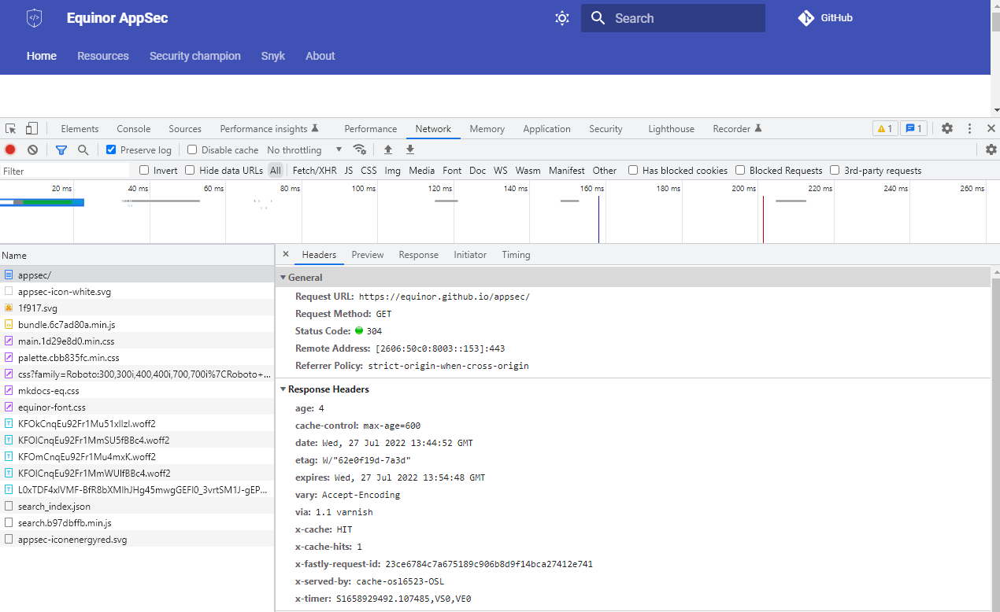

# Security Tools
This site is intended for AppSec related tools for developers. Most tools here should be possible to use by developers and Security Champions with little or no training. We will however include a few expert level tools for those what want to dive deeper into the topics of security tools.

If you have any tools you would like to include on this list, don't hesitate to add it yourself with a PR, or reach out to us!

## Fundamentals
### Snyk
[Snyk](https://snyk.io/) is a developer centric tool for scanning source code and dependencies for known vulnerabilities. Equinor has license for Snyk for all developers, so it's highly recommended for all teams to use.

Check out our [Snyk guidelines](../snyk/index.md) for how to get started.

### Browser developer tools
All major browser today comes with a built in developer tools which can be opened with pressing `CTRL+SHIFT+I` or `F12`.

These built in tools are quite extensive, and you can get very far in inspecting a web application and peeking into the security in place just by using the tools in your browser. Check [Chrome](https://developer.chrome.com/docs/devtools/) and [Firefox](https://firefox-dev.tools/) for documentation of how to use these tools.

## Intermediate
### OWASP ZAP
[OWASP ZAP](https://www.zaproxy.org/) is an open-source web application security scanner. For automation of web scanning ZAP is a powerful tool for finding vulnerabilities. ZAP is free to use, but Equinor has no support on it's usage as of now.

## Expert
### Kali Linux
[Kali Linux](https://www.kali.org/) is a Debian-derived Linux distribution designed for digital forensics and penetration testing.

Kali Linux has around 600 penetration-testing programs and is a good starting point for people interested in developing their skills in penetration testing.
